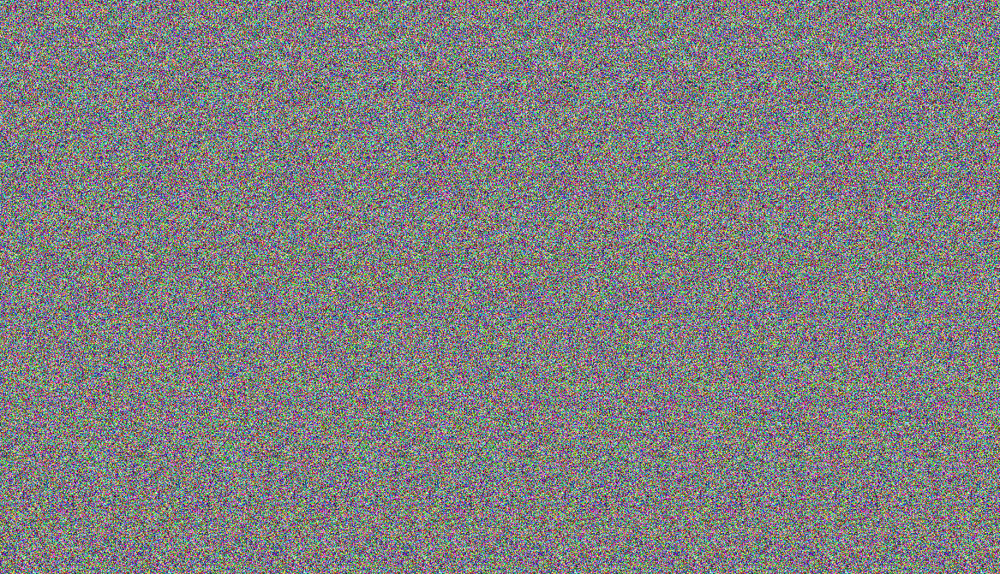

# StereoDraw

This is a simple web app that keeps a blank canvas in memory that the user can draw on and generates a stereogram from it.

[Open StereoDraw in Github Pages](https://pnowell.github.io/StereoDraw/)

## Interface

Just move your mouse around on the canvas, click and drag to paint, and scroll the mouse wheel to adjust depth (scroll up to push
the depth in further and scroll down to pull the depth out closer).

### Keyboard hotkeys

+ The "c" key clears the canvas
+ The "s" key saves the depth buffer and the stereogram as PNG files
  + You might need to grant permission to save multiple files

## Example

"Stereo Draw!" stereogram

Depth map

## Technical details

### Image buffers

There are 3 canvases / image buffers:

+ A drawing canvas that's completely blank at first.
+ A "cursor" canvas which copies the drawing canvas and adds a cursor representation to it.
+ A stereo canvas that takes the cursor canvas and generates a stereogram from it

### How the stereogram generation works

The basic idea is that, for each row, it scans across the depth information (from the cursor canvas for normal rendering, or from
the drawing canvas for image output) and either chooses a random dot or copies a pixel from some offset to the left.  To explain
the decision made per-pixel, imagine your right eye scanning across a row of pixels.  At each point, the depth map tells you how
far we want the image to appear at that point.  If we want to make the image appear to be far away, we need your left eye to look
further to the left.  If we want it to appear closer, your left eye should look more to the right.  So we come up with function
to accomplish this.  Given that the displacement between a person's eyes are on average roughly 2 inches or 50mm we arbitrarily
choose 42mm for the maximum pixel offset (when the depth map is black i.e. far away) and 35mm for the minimum pixel offset (when
the depth map is white i.e. near).

As we scan from left to right, we compute that offset and if it would have us copy a pixel at a negative X value, we instead
generate random R, G and B values.

There is one more subtle point: if we did the above exactly as stated, then when the depth jumps down from close to far away,
the pixel offset would suddenly increase and over the next few pixels, we would rescan a pattern of pixels that we've already
copied once, which leads to a weird ghosting effect.  To avoid this, we keep track of the right-most copied pixel's x-coordinate
as we scan across a row (initialized to zero), and each time we compute which pixel we'd like to copy from, if that desired pixel
is further to the right than the current right-most copied pixel, then we do it and update right-most.  If it's to the left of
the right-most copied pixel, we generate noise instead.
